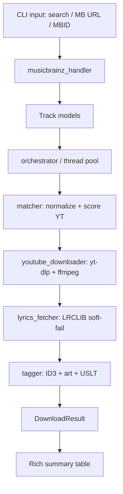

# `cratedig` — Music-to-Audio CLI · Technical Design & Build Plan

> **Status:** Approved spec, v0.2 (adds lyrics) — *no application code written yet.*
> **Purpose:** complete architecture spec + phased build roadmap. Reviewed/approved first, then handed to Claude Code one phase at a time.
> **Working name:** `cratedig` (placeholder — see §14). Command: `crate`. Package: `cratedig`. Swappable everywhere with one find/replace.
> **Changes since v0.1:** lyrics embedding (LRCLIB), resolved credentials decision (prompt-per-user), YouTube anti-bot/cookies handling, matcher normalization, pipx-first distribution.
> **Changes since v0.2 (MusicBrainz migration):** metadata source is now **MusicBrainz** (free, keyless) instead of Spotify; input is a MusicBrainz release/recording URL/MBID **or** a free-text search query (no playlists); `Track.source_id` replaces `spotify_id`; exceptions `ProviderError`/`ProviderApiError` replace `SpotifyError`/`SpotifyApiError`; no credentials required.

---

## 0. Legal / scope note (read first)

This tool fetches metadata from the MusicBrainz API (free, open, keyless), downloads matching audio from YouTube via `yt-dlp`, and fetches lyrics from LRCLIB (a free, open, community-contributed lyrics database — no key, no DRM). The download step sits in a **legal gray area** depending on jurisdiction and the YouTube ToS, exactly like the upstream projects this is modeled on (`spotDL`, `yt-dlp`). Build it for content you have the right to use; ship a clear disclaimer in the README.

---

## 1. Goals & non-goals

**Goals**
- Input a **MusicBrainz** release (album) or recording (track) — as a URL or bare MBID — **or** a free-text search query.
- Fetch clean metadata via the MusicBrainz API (free, keyless).
- Find the best-matching audio on YouTube and download the highest-quality stream.
- Transcode to MP3 (or M4A) and embed full ID3 tags + album art + **lyrics**.
- Run on Windows as (a) a `pipx`/`pip`-installable CLI for devs and (b) a standalone `.exe` for non-developers from GitHub Releases.
- Download multiple tracks concurrently.

**Non-goals (v1)**
- No DRM circumvention. We read only public MusicBrainz metadata.
- No GUI (CLI only).
- No playlist input (MusicBrainz has no user playlists); albums (releases) and single tracks (recordings) only.
- No Apple Music / Deezer / Spotify sources (later extension point).
- Lyrics are **best-effort enrichment**, never a hard requirement.

---

## 2. Tech stack & rationale

| Concern | Choice | Why |
|---|---|---|
| Language | Python 3.10+ | `match`, modern typing + packaging. |
| CLI framework | **Typer** | Type-hint-driven, auto `--help`, composes with Rich. Cleaner than argparse. |
| Terminal UX | **Rich** | Progress bars, colored logging, error panels. |
| Metadata | **MusicBrainz API** (via `requests`) | Free, keyless, open. Self-throttled to ~1 req/s with a descriptive `User-Agent` (MusicBrainz returns HTTP 503 above that). Cover art via the Cover Art Archive. |
| Search + download | **yt-dlp** | De-facto standard; Python API + search + post-processing. |
| Lyrics | **LRCLIB** via `requests` | Free, no API key, matches on duration (same philosophy as our YT matcher). We call the HTTP API directly with `requests` rather than a wrapper lib — fewer deps, full control. |
| Audio tagging | **Mutagen** | ID3v2 (incl. APIC art + USLT lyrics), MP4 atoms. |
| Audio transcode | **FFmpeg** (external binary) | Required by yt-dlp. **#1 gotcha** — see §10. |
| Config / models | **Pydantic v2** + `python-dotenv` | Typed config, validated models. |
| Fuzzy matching | **rapidfuzz** | String similarity for the YT matcher. |
| Tests | **pytest** + mocks | Mock MusicBrainz / yt-dlp / LRCLIB; no network in tests. |
| Packaging | **pyproject.toml** + **PyInstaller** | Console-script for devs; `.exe` for end users. |

No new runtime dependency is needed for lyrics — `requests` is already present (used for cover art).

---

## 3. Directory structure (`src` layout)

```
cratedig/
├── pyproject.toml
├── requirements.txt
├── requirements-dev.txt
├── README.md
├── LICENSE                     # MIT (suggested)
├── CLAUDE.md                   # Claude Code working agreement (workflow + conventions)
├── DESIGN.md                   # this document
├── .env.example
├── .gitignore
│
├── src/
│   └── cratedig/
│       ├── __init__.py
│       ├── __main__.py
│       ├── cli.py              # Typer app
│       ├── config.py           # Pydantic Settings: secrets, paths, defaults
│       ├── models.py           # Track / DownloadResult (the data contract)
│       ├── exceptions.py       # custom exception hierarchy
│       ├── logging_setup.py
│       │
│       ├── core/
│       │   └── orchestrator.py # pipeline + concurrency
│       │
│       ├── providers/
│       │   └── musicbrainz_handler.py
│       │
│       ├── download/
│       │   ├── youtube_downloader.py
│       │   └── matcher.py
│       │
│       ├── lyrics/
│       │   └── lyrics_fetcher.py   # NEW: LRCLIB lookup, soft-fail
│       │
│       └── tagging/
│           └── tagger.py        # ID3 tags + cover art + USLT lyrics
│
├── tests/
│   ├── conftest.py
│   ├── test_musicbrainz_handler.py
│   ├── test_matcher.py
│   ├── test_lyrics_fetcher.py   # NEW
│   ├── test_tagger.py
│   └── fixtures/
│
└── .github/workflows/
    ├── ci.yml
    └── release.yml
```

---

## 4. Data flow

```
CLI input (search query / MB URL / MBID)
      │
      ▼
[cli.py]  parse args, load config
      │
      ▼
[musicbrainz_handler]  search query OR look up release/recording MBID ─► fetch metadata
      │
      ▼
List[Track]  (title, artists, album, isrc, duration, cover_art_url, lyrics=None)
      │
      ▼
[orchestrator]  dispatch to thread pool (2–3 workers + jitter)
      │
      ├─ per track ─► [matcher]  normalize + ytsearch + score ─► best video URL
      │                   │
      │                   ▼
      │             [youtube_downloader]  bestaudio ─► FFmpeg ─► .mp3
      │                   │
      │                   ▼
      │             [lyrics_fetcher]  LRCLIB /get (by duration) ─► /search fallback
      │                   │            (soft fail → None)
      │                   ▼
      │             track = replace(track, lyrics=...)   # enrich frozen Track
      │                   │
      │                   ▼
      │             [tagger]  ID3 tags + APIC art + USLT lyrics (each soft-fail)
      │                   │
      │                   ▼
      │             DownloadResult(success | skipped | not_found | failed)
      │
      ▼
[cli.py]  Rich summary table
```



---

## 5. The data contract — `models.py`

`Track` stays **frozen** (good for a metadata contract). Lyrics are fetched *after* construction, so the orchestrator produces an enriched copy via `dataclasses.replace(track, lyrics=...)` rather than mutating in place.

```python
from dataclasses import dataclass
from enum import Enum

@dataclass(frozen=True, slots=True)
class Track:
    title: str
    artists: list[str]            # ordered; artists[0] is primary
    album: str
    isrc: str | None              # strong signal for matching
    duration_ms: int              # used by BOTH the YT matcher and LRCLIB
    track_number: int
    disc_number: int
    release_year: str | None
    cover_art_url: str | None
    source_id: str               # the source's stable ID (for MusicBrainz, the recording MBID)
    lyrics: str | None = None     # NEW: enriched post-fetch via dataclasses.replace()

    @property
    def primary_artist(self) -> str:
        return self.artists[0] if self.artists else "Unknown Artist"

    @property
    def search_query(self) -> str:
        return f"{self.primary_artist} - {self.title}"

class ResultStatus(str, Enum):
    SUCCESS = "success"
    SKIPPED = "skipped"
    NOT_FOUND = "not_found"
    FAILED = "failed"

@dataclass
class DownloadResult:
    track: Track
    status: ResultStatus
    output_path: str | None = None
    youtube_url: str | None = None
    lyrics_found: bool = False     # NEW: surfaced in the summary table
    error: str | None = None
```

---

## 6. Module responsibilities & interfaces

### `providers/musicbrainz_handler.py`
Keyless MusicBrainz lookup. Detects a MusicBrainz **release** (album) or **recording** (track) URL or bare MBID — a bare MBID is tried as a recording first, falling back to a release on HTTP 404 — or treats the input as a free-text **search** (highest-scoring recording, then a detail lookup). Returns a normalized `list[Track]`. Self-throttled to ~1 req/s with a descriptive `User-Agent`; network/API/JSON failures raise `ProviderApiError` (fatal for the run). Cover art comes from the Cover Art Archive (`/release/<mbid>/front-500`). A standalone recording has no album context, so `track_number`/`disc_number` default to 1 (known limitation).
```python
class MusicBrainzHandler:
    def __init__(self, rate_limit_s: float = 1.0) -> None: ...
    def fetch(self, query_or_url_or_mbid: str) -> list[Track]: ...
```

### `download/matcher.py` (Phase 2) — the make-or-break module
**Normalize both sides before comparing** (this is where most clones fail):
- strip `(feat. …)`, `(ft. …)`, `[Official Audio]`, `(Official Video)`, `(Lyrics)`, lowercase, drop punctuation, unify `feat/ft/featuring`.
- match the **set of artists**, not the joined string.
Then score candidates with **duration** as the heaviest weight (reject if off by > ~10s), title/artist fuzzy similarity (`rapidfuzz`), bonus for `- Topic` / "Official Audio" channels, penalty for `live/cover/remix/sped up/8d` unless the source track's title itself contains them. Use ISRC where available for near-certain matches.
```python
def find_best_match(track: Track, ydl) -> str | None: ...
```

### `download/youtube_downloader.py` (Phase 3)
Wraps `yt-dlp` (`bestaudio` → `FFmpegExtractAudio`). **Idempotent**: skip if the target file already exists. Supports an optional `--cookies-from-browser` pass-through (needed when YouTube returns "Sign in to confirm you're not a bot"). Per-request sleep/jitter to reduce throttling.
```python
class YouTubeDownloader:
    def __init__(self, output_dir, audio_format, bitrate, cookies_from_browser=None) -> None: ...
    def download(self, video_url: str, track: Track) -> str: ...
```

### `lyrics/lyrics_fetcher.py` (Phase 4) — NEW
Hits LRCLIB directly. Strategy: try `/api/get` (exact match using title + primary artist + album + **duration in seconds**); on 404, fall back to `/api/search` and pick the candidate with the closest duration. Prefer `plainLyrics` for USLT; if only `syncedLyrics` exists, strip `[mm:ss.xx]` timestamps. **Soft fail — never raises into the pipeline**, returns `None` on any miss/error/timeout. Sends a descriptive `User-Agent` (LRCLIB requests one).
```python
LRCLIB_BASE = "https://lrclib.net/api"

def fetch_lyrics(track: Track, timeout: float = 10.0) -> str | None:
    """Return plain lyrics text or None. Must not raise."""
```

### `tagging/tagger.py` (Phase 4)
Writes tags + embeds cover art + embeds lyrics. Each step is independently guarded so one failure doesn't lose the others.
```python
from mutagen.id3 import ID3, USLT  # + TIT2/TPE1/TALB/TRCK/TYER/TSRC/APIC

class Tagger:
    def tag(self, file_path: str, track: Track) -> None:
        # ... write text frames + APIC cover art ...
        if track.lyrics:
            tags.add(USLT(encoding=3, lang="eng", desc="", text=track.lyrics))
        # M4A path: audio["\xa9lyr"] = track.lyrics
```

### `core/orchestrator.py` (Phase 5)
Owns concurrency and the per-track pipeline. Calls lyrics_fetcher, builds the enriched track via `replace()`, catches every per-track exception into a `DownloadResult`.
```python
class Orchestrator:
    def __init__(self, handler, downloader, lyrics_fetcher, tagger, max_workers: int) -> None: ...
    def run(self, url: str) -> list[DownloadResult]: ...
```

### `cli.py` (Phase 5)
Typer commands; `--format`, `--bitrate`, `--output`, `--workers`, `--cookies-from-browser`, `--no-lyrics`. Rich progress + final summary (incl. a "lyrics ✓/✗" column).

---

## 7. Error-handling strategy

```
CratedigError (base)
├── ConfigError          # retained but unused (MusicBrainz is keyless)
├── ProviderError
│   ├── InvalidUrlError                                          → fatal for that input
│   └── ProviderApiError # MusicBrainz network / 4xx / 5xx       → fatal for the run
├── MatchNotFoundError                                           → per-track NOT_FOUND
├── DownloadError        # yt-dlp/ffmpeg                         → per-track FAILED
└── TaggingError                                                 → per-track FAILED (file kept)
```

- **Fail fast on the provider fetch, fail soft per track.** A 200-track album never aborts because of one bad track.
- **Lyrics never raise.** LRCLIB miss / 404 / timeout → `lyrics = None`, tag everything else, move on. (No `LyricsError` is propagated; failures are swallowed inside `lyrics_fetcher`.)
- MusicBrainz 503 (rate limit) → avoided by self-throttling to ~1 req/s with a descriptive `User-Agent`. YouTube bot-wall → clear message pointing to `--cookies-from-browser` and `yt-dlp -U`.

---

## 8. Concurrency / speed

Download is I/O- and subprocess-bound, so **`ThreadPoolExecutor`** is correct (not asyncio: yt-dlp is blocking).
- Default **2–3 workers** (not 4) with **random jitter** (1–3s) between requests — YouTube anti-bot is aggressive; over-parallelizing causes 429s / temp IP blocks and is often *slower* overall.
- Fetch MusicBrainz metadata in one cheap, rate-limited sequential pass, then fan out downloads.
- Lyrics calls are light; do them inside each worker after the download.

---

## 9. Configuration

- **MusicBrainz: no credentials.** The API is keyless — nothing to prompt for, bundle, or cache. We send a descriptive `User-Agent` and self-throttle to ~1 req/s (HTTP 503 above that). Optional output/download knobs come from env / a local `.env`; there are no secrets. (`ConfigError` is retained in the exception hierarchy but is now unused.)
- **LRCLIB:** no key. Just a descriptive `User-Agent` (e.g. `cratedig/0.1.0 (+repo-url)`).

---

## 10. Packaging & distribution (Windows + GitHub)

- **FFmpeg** is an external binary, not pip. Dev: `winget install Gyan.FFmpeg`. `.exe`: bundle `ffmpeg.exe` or detect-and-instruct. Without it, audio conversion silently fails.
- **Primary distribution: `pipx install git+https://github.com/<you>/cratedig.git`** (isolated; devs don't need an `.exe`).
- **`.exe` for non-devs:** PyInstaller with **`--onedir`** (not `--onefile`). `--onefile` extracts to Temp at runtime and is far more likely to be flagged by **Windows Defender** as a false-positive Trojan. Document an AV-exclusion note and submit a false-positive report to Microsoft. (Code signing needs a paid EV cert — skip for v1.)
- Entry point: `[project.scripts]  crate = "cratedig.cli:app"`.
- **GitHub Actions:** `ci.yml` (ruff + pytest on push/PR), `release.yml` (build `.exe`, attach to Release on `v*` tag).

---

## 11. Phased build plan (one phase per prompt → one PR per phase)

| Phase | Deliverable | Done when |
|---|---|---|
| **0 — Scaffold** | repo skeleton, `pyproject.toml`, `requirements*.txt`, `.env.example`, `.gitignore`, `models.py`, `exceptions.py`, empty modules | `pip install -e .` works; `crate --help` prints. |
| **1 — Metadata** | `musicbrainz_handler.py` (search / release / recording), mocked tests | a query or MBID → correct `Track`(s). |
| **2 — Matcher** | `matcher.py` normalize + score | sensible YT URL for known tracks; scoring unit-tested. |
| **3 — Download** | `youtube_downloader.py` (bestaudio→ffmpeg→mp3, skip-if-exists, cookies flag) | produces a playable `.mp3`. |
| **4 — Tagging + Lyrics** | `tagger.py` (ID3 + art + USLT) **and** `lyrics_fetcher.py` (LRCLIB, soft-fail) | tags + art + embedded lyrics visible in a player; missing lyrics never crash. |
| **5 — Orchestrate + CLI** | `orchestrator.py` + `cli.py`, per-track isolation, enrich via `replace()` | `crate download <playlist>` end-to-end with summary table. |
| **6 — Concurrency** | ThreadPoolExecutor + jitter + `--workers` | parallel playlist download, no crashes/bans. |
| **7 — Package + ship** | PyInstaller `--onedir`, CI + release workflows, README/LICENSE | tagged release produces a downloadable build. |

---

## 12. `requirements.txt`

```
yt-dlp>=2024.0
mutagen>=1.47
typer>=0.12
rich>=13.7
pydantic>=2.7
pydantic-settings>=2.2
python-dotenv>=1.0
requests>=2.31
rapidfuzz>=3.9
```
`requirements-dev.txt`: `pytest`, `pytest-mock`, `responses`, `ruff`, `pyinstaller`.
> `ffmpeg` is NOT a pip package (see §10). No new dep added for lyrics.

---

## 13. Open questions

1. **Output format** — MP3 default (max compatibility) vs M4A/Opus? Expose `--format`.
2. **Synced lyrics** — embed plain only (USLT), or also write the LRC `syncedLyrics` as a `<track>.lrc` sidecar file for karaoke-capable players? (Cheap bonus.)
3. **Matcher strictness** — duration tolerance + how hard to penalize live/remix.
4. **Final name** — confirm `cratedig` (§14) and verify availability on PyPI + GitHub.

**Known limitations (MusicBrainz source):**
- A free-text search resolves to the single highest-scoring recording (no interactive disambiguation yet).
- A standalone recording (no release context) gets `track_number`/`disc_number` = 1 and no album/cover art.
- No playlist input — MusicBrainz has no user playlists; pass a release (album) or recording (track).
- A bare MBID is type-ambiguous, so it is tried as a recording first and falls back to a release on HTTP 404.

---

## 14. Naming (to confirm)

Working name `cratedig` (crate-digging = hunting/collecting music). Alternatives: `tonearm`, `lyrebird`. Verify the chosen name is free on **PyPI** and **GitHub** before locking. Once confirmed, this whole doc + CLAUDE.md get the name swapped in one pass.
