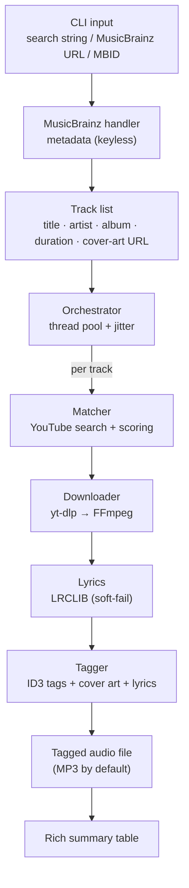

# cratedig

> **Music-to-Audio CLI.** Give it a search query — or a MusicBrainz release/recording URL or
> MBID — and it fetches the metadata, finds the matching audio on YouTube, transcodes it (MP3 by
> default), and embeds ID3 tags, cover art, and lyrics. **Keyless: no API keys, no accounts.**

## How it works

cratedig is built around a **two-source design**, because the best source of clean *metadata* is
not the best source of *audio*:

- **MusicBrainz** (free, keyless) is the source of truth for **metadata** — the canonical title,
  artist(s), album, track/disc numbers, release year, ISRC, and cover art. It is *not* an audio
  host.
- **YouTube** (via `yt-dlp`) is the source of the **audio**. cratedig searches it for the track
  described by the MusicBrainz metadata, scores the candidates, and downloads the best match.

So the flow is: look up trustworthy metadata first, then go find audio that matches it, then
stitch the two back together by tagging the downloaded file with the metadata (plus cover art
from the Cover Art Archive and lyrics from LRCLIB). The metadata drives everything — including
how the matcher tells the real recording apart from covers, live versions, and remixes.

## Requirements

- **Python 3.10+**
- **[FFmpeg](https://ffmpeg.org/)** installed and on your `PATH` (an external binary, *not* a pip
  package). This is the #1 gotcha. On Windows:

  ```powershell
  winget install Gyan.FFmpeg
  ```

  Then **reopen your terminal** so the updated `PATH` takes effect (verify with `ffmpeg -version`).
- **No API keys.** Metadata comes from [MusicBrainz](https://musicbrainz.org/), which is free and
  keyless; cratedig stays within its ~1 request/second rate limit automatically.

## Install

With [pipx](https://pipx.pypa.io/) (recommended — installs the `crate` command in its own
isolated environment):

```bash
pipx install git+https://github.com/pchrysostomou/cratedig.git
```

For development (clone + editable install with the test/dev extras):

```bash
git clone https://github.com/pchrysostomou/cratedig.git
cd cratedig
pip install -e ".[dev]"
```

(Plain `pip install -e .` works too if you don't need the dev tools.)

## Standalone executable (Windows)

> **Coming soon.** A prebuilt `crate.exe` will be published on the
> [GitHub Releases](https://github.com/pchrysostomou/cratedig/releases) page so you can run
> cratedig without installing Python. The download/run instructions (folder layout, bundling
> FFmpeg, the Windows Defender note) will be documented here once the build lands.
> _(TODO: PyInstaller build + release docs — tracked as a later task.)_

## Usage

The command is `crate`. The main subcommand is `download`:

```bash
# Free-text search ("Artist - Title")
crate download "Daft Punk - Get Lucky"

# A MusicBrainz release URL or MBID -> the whole album
crate download "https://musicbrainz.org/release/<mbid>"

# A MusicBrainz recording URL or MBID -> a single track
crate download "https://musicbrainz.org/recording/<mbid>"

crate --help        # full help
crate --version     # print the version and exit
```

### Input forms

`crate download <input>` accepts any of:

- a **search string** in `"Artist - Title"` form (recommended; the artist helps the matcher),
- a **MusicBrainz release** URL or bare MBID — downloads every track on the album,
- a **MusicBrainz recording** URL or bare MBID — downloads that single track.

## Options

These apply to `crate download` (except `--version`/`--help`, which are global, e.g.
`crate --version`):

| Option | Default | Description |
| --- | --- | --- |
| `--output` | `~/Music/cratedig` | Directory to write downloaded files into. |
| `--format` | `mp3` | Audio format/codec for FFmpeg (e.g. `mp3`, `m4a`, `opus`, `flac`). |
| `--bitrate` | `192` | Audio bitrate in kbps. |
| `--workers` | `3` | Number of parallel download workers. |
| `--cookies-from-browser` | _(none)_ | Browser to read YouTube cookies from (anti-bot), e.g. `firefox`. |
| `--no-lyrics` | off | Skip fetching lyrics from LRCLIB. |
| `--verbose` | off | Enable verbose (INFO) logging. |
| `--version`, `-V` | — | Print the version and exit. |

Defaults can also be set via a local `.env` file (see [`DESIGN.md`](DESIGN.md) §9); CLI flags take
priority.

## Real-world notes

- **YouTube anti-bot / HTTP 403.** Some tracks fail to download with a `403 Forbidden` until you
  supply browser cookies. Pass `--cookies-from-browser firefox`:

  ```bash
  crate download "Artist - Title" --cookies-from-browser firefox
  ```

  **Firefox is recommended.** Chrome can fail to export its cookie database while the browser is
  running (and on recent versions even when closed); Firefox is the reliable option.
- **Per-track isolation.** One failing track never aborts the rest of an album — each gets its own
  result (downloaded / skipped / not found / failed), summarized at the end.
- **The matcher picks the official recording.** Candidates whose titles advertise a *cover*,
  *live*, *remix*, *sped up*, *nightcore*, *8D*, or *reverb* version (that you didn't ask for) are
  filtered out, and "- Topic" / official channels are preferred — so you get the studio track, not
  a fan upload.

## Software architecture

The pipeline (adapted from [`DESIGN.md`](DESIGN.md) §4):



MusicBrainz supplies the metadata; the matcher uses it to find the right audio on YouTube; the
downloader transcodes via FFmpeg; lyrics (LRCLIB) and tags (Mutagen) enrich the file. Lyrics and
each tagging step are *soft-fail* — a miss never aborts the download. See
[`DESIGN.md`](DESIGN.md) for the full architecture and module responsibilities.

## Legal & disclaimer

cratedig reads only public **MusicBrainz** metadata (no DRM is bypassed) and fetches the matching
audio from YouTube via `yt-dlp`.

Use it only for content you have the right to download — public-domain or Creative Commons works,
your own uploads, or material you may lawfully copy for personal use. Downloading copyrighted
audio may violate YouTube's Terms of Service and copyright law, which vary by jurisdiction.
**You are solely responsible for how you use this tool.** It is provided as-is, for lawful use,
with no warranty.

## License

`cratedig` is free software, licensed under the **GNU General Public License v3.0 or later
(GPL-3.0-or-later)**. See [`LICENSE`](LICENSE) for the full text.
